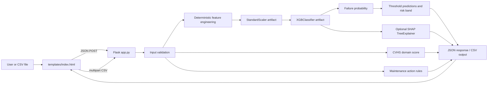
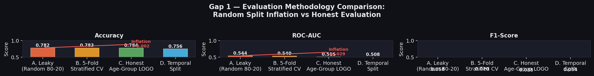
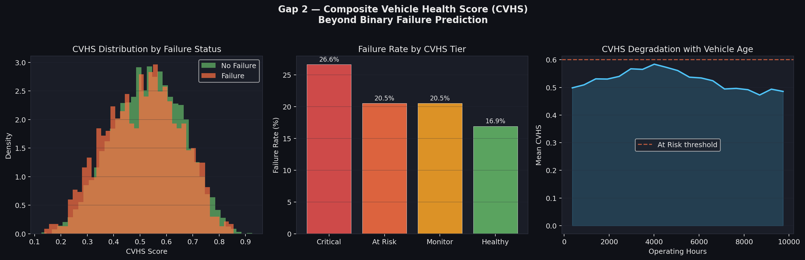
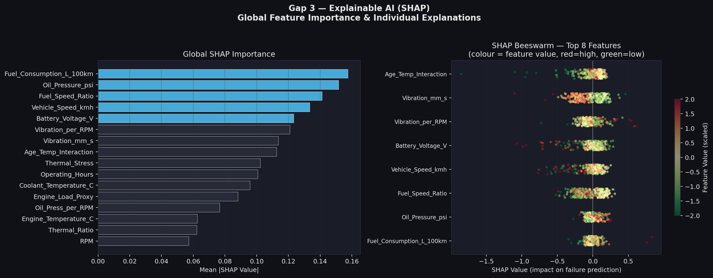
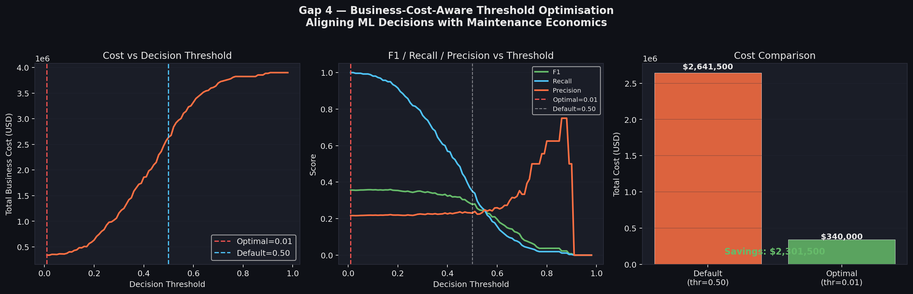
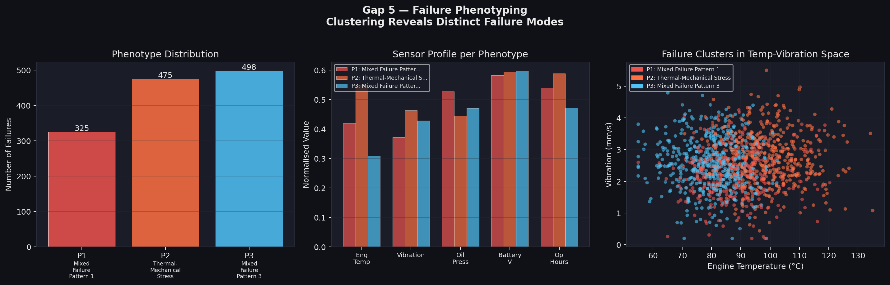
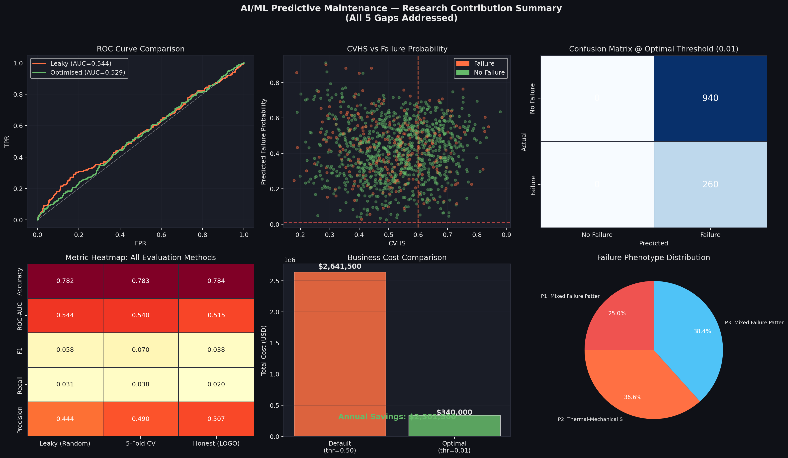

# Vehicle Health Monitoring System

An end-to-end local predictive-maintenance application for estimating vehicle
failure risk from sensor readings. The project combines a Flask API, a
browser-based dashboard, a serialized XGBoost classifier, deterministic feature
engineering, a domain-specific Composite Vehicle Health Score (CVHS), SHAP
explanations, and batch CSV processing.

> **Important:** This repository contains the trained runtime artifacts, the
> source dataset, and the local inference application. The included
> `vehicle_health_colab.py` uses `dataset.csv` for training and evaluation.

## Contents

- [What the system does](#what-the-system-does)
- [Architecture](#architecture)
- [Repository layout](#repository-layout)
- [Runtime data flow](#runtime-data-flow)
- [Input sensors and domain rules](#input-sensors-and-domain-rules)
- [Feature engineering](#feature-engineering)
- [Model and serialized artifacts](#model-and-serialized-artifacts)
- [Prediction semantics](#prediction-semantics)
- [Web interface](#web-interface)
- [API reference](#api-reference)
- [Installation and local usage](#installation-and-local-usage)
- [Batch CSV format](#batch-csv-format)
- [Training and model export](#training-and-model-export)
- [Research figures](#research-figures)
- [Operational notes and limitations](#operational-notes-and-limitations)
- [Troubleshooting](#troubleshooting)
- [Development checklist](#development-checklist)

## What the system does

The application supports three main workflows:

1. **Single-vehicle prediction** - enter nine live or simulated sensor values
   and receive a failure probability, risk level, threshold-based predictions,
   CVHS health score, maintenance recommendations, and optional SHAP
   explanations.
2. **Batch prediction** - upload a CSV containing the nine raw sensor columns.
   The server predicts every row, returns a summary and a 200-row preview, and
   can download the complete enriched CSV.
3. **Model inspection** - view the loaded model type, estimator count, feature
   count, scaler, thresholds, engineering constants, and SHAP availability.

The application is intended for local testing, research demonstration, and
decision support. It is not a replacement for vehicle control systems,
professional inspection, or safety-critical maintenance procedures.

## Architecture



### Runtime components

| Component | Responsibility |
| --- | --- |
| `app.py` | Loads artifacts, engineers features, performs inference, calculates CVHS, produces SHAP explanations, serves HTML, and exposes REST endpoints. |
| `templates/index.html` | Self-contained frontend with CSS and JavaScript for single prediction, batch upload, model information, charts/badges, and result rendering. |
| `best_model.pkl` | Serialized `xgboost.sklearn.XGBClassifier` used for failure probability inference. |
| `scaler.pkl` | Serialized `sklearn.preprocessing.StandardScaler` fitted on the 16 model features. |
| `feature_names.pkl` | The exact ordered list of 16 model features. |
| `engineer_params.pkl` | Fixed training-time normalization constants for RPM and engine temperature. |
| `vehicle_health_colab.py` | Reference training/evaluation workflow that loads `dataset.csv`, compares baseline classifiers, evaluates metrics, and exports artifacts. |
| `img/` | Research and presentation figures referenced by the project. |

## Repository layout

```text
.
├── app.py                         # Flask application and inference pipeline
├── vehicle_health_colab.py        # Training/evaluation reference script
├── dataset.csv                    # 6,000-row labeled vehicle sensor dataset
├── best_model.pkl                 # Trained XGBClassifier
├── scaler.pkl                     # StandardScaler for model features
├── feature_names.pkl              # Ordered model feature names
├── engineer_params.pkl            # {'rpm_max': 4670.0, 'temp_max': 135.0}
├── templates/
│   └── index.html                 # Dashboard HTML, CSS, and JavaScript
├── img/
│   ├── fig1_evaluation_gap.png
│   ├── fig2_cvhs.png
│   ├── fig3_shap_xai.png
│   ├── fig4_cost_threshold.png
│   ├── fig5_phenotyping.png
│   └── fig6_research_dashboard.png
├── README.md
└── .gitignore
```

The repository currently does not include a `requirements.txt` or a
`research_summary.pkl`. `app.py` therefore uses a built-in optimal threshold
fallback of `0.01` when `research_summary.pkl` is absent.

## Dataset

`dataset.csv` is the labeled dataset used by the training workflow. It contains
6,000 records and 11 columns:

- `Record_ID`: sequential record identifier from 1 to 6,000.
- Nine numeric vehicle sensor features used for inference.
- `Failure`: binary target label where `0` means no recorded failure and `1`
  means failure.

### Dataset quality summary

| Property | Value |
| --- | ---: |
| Rows | 6,000 |
| Columns | 11 |
| Failure = 0 | 4,702 |
| Failure = 1 | 1,298 |
| Failure rate | 21.63% |
| Missing values | 0 |
| Duplicate rows | 0 |

### Dataset columns and observed ranges

The observed ranges below are calculated from the checked-in dataset. They are
descriptive dataset statistics and should not be confused with the narrower
domain-safe ranges used by CVHS and the dashboard.

| Column | Type | Observed minimum | Observed maximum | Role |
| --- | --- | ---: | ---: | --- |
| `Record_ID` | integer | 1 | 6,000 | Identifier |
| `Engine_Temperature_C` | float | 55.00 | 135.00 | Raw input |
| `RPM` | integer | 700 | 4,670 | Raw input |
| `Oil_Pressure_psi` | float | 31.86 | 80.00 | Raw input |
| `Vibration_mm_s` | float | 0.20 | 5.70 | Raw input |
| `Battery_Voltage_V` | float | 10.50 | 15.00 | Raw input |
| `Coolant_Temperature_C` | float | 45.00 | 125.00 | Raw input |
| `Fuel_Consumption_L_100km` | float | 4.17 | 16.48 | Raw input |
| `Vehicle_Speed_kmh` | float | 0.00 | 123.32 | Raw input |
| `Operating_Hours` | float | 102.70 | 9,996.20 | Raw input |
| `Failure` | integer | 0 | 1 | Binary target |

The training script removes `Record_ID` and `Failure` before fitting models.
The Flask inference application also ignores `Record_ID` and any input
`Failure` label: only the nine raw sensor columns are required for prediction.

## Runtime data flow

### Single prediction

1. The dashboard collects nine numeric sensor values.
2. `POST /api/predict` converts every value to `float` and rejects missing or
   invalid fields.
3. The values are placed into a one-row pandas DataFrame in the canonical raw
   feature order.
4. Seven engineered features are added.
5. The DataFrame is reordered using `feature_names.pkl`.
6. The 16 features are transformed with the saved `StandardScaler`.
7. The saved XGBoost model returns class-1 failure probability.
8. The probability is evaluated at both the research threshold and the default
   `0.50` threshold.
9. CVHS, CVHS tier, risk level, maintenance actions, and SHAP explanations are
   calculated.
10. The result is returned as JSON and rendered by the dashboard.

### Batch prediction

`POST /api/batch` reads an uploaded CSV with pandas. It preserves all original
columns and appends:

- `Failure_Probability_%`
- `Prediction`
- `CVHS`
- `CVHS_Tier`
- `Risk_Level`

The response contains aggregate counts and only the first 200 output rows for
preview. `POST /api/batch/download` runs the same pipeline and returns the full
output as `vehicle_predictions.csv`.

## Input sensors and domain rules

All nine raw columns are required for both single and batch inference.

| Column | Unit | Safe range | CVHS weight |
| --- | --- | ---: | ---: |
| `Engine_Temperature_C` | °C | 60–100 | 0.18 |
| `RPM` | rpm | 600–3000 | 0.08 |
| `Oil_Pressure_psi` | psi | 25–80 | 0.12 |
| `Vibration_mm_s` | mm/s | 0–3.0 | 0.15 |
| `Battery_Voltage_V` | V | 11.8–14.8 | 0.10 |
| `Coolant_Temperature_C` | °C | 50–95 | 0.13 |
| `Fuel_Consumption_L_100km` | L/100 km | 6–12 | 0.09 |
| `Vehicle_Speed_kmh` | km/h | 0–130 | 0.05 |
| `Operating_Hours` | h | 0–8000 | 0.10 |

The ranges are used by the UI for guidance and by CVHS for health scoring.
They are not hard input bounds in the Flask API; values outside the ranges are
accepted so that abnormal conditions can be scored and investigated.

### CVHS calculation

For each sensor, the implementation defines:

```text
mid       = (safe_low + safe_high) / 2
half      = (safe_high - safe_low) / 2
health    = clip(1 - abs(value - mid) / half, 0, 1)
```

The final score is the weighted average of the nine health values. A value at
the center of its safe range contributes full health; values at or beyond the
range edges contribute zero for that sensor.

| CVHS score | Tier |
| ---: | --- |
| `>= 0.80` | Healthy |
| `0.60–0.7999` | Monitor |
| `0.40–0.5999` | At Risk |
| `< 0.40` | Critical |

### Risk level calculation

Risk level is based on model failure probability, independently of CVHS:

| Failure probability | Risk |
| ---: | --- |
| `> 0.70` | Critical |
| `> 0.50` and `<= 0.70` | High |
| `> 0.30` and `<= 0.50` | Medium |
| `<= 0.30` | Low |

## Feature engineering

The runtime model uses 16 ordered features: the nine raw sensors plus seven
derived features. The exact order is loaded from `feature_names.pkl`.

| Feature | Formula |
| --- | --- |
| `Thermal_Stress` | `Engine_Temperature_C - Coolant_Temperature_C` |
| `Engine_Load_Proxy` | `(RPM / 4670.0) * (Engine_Temperature_C / 135.0)` |
| `Oil_Press_per_RPM` | `Oil_Pressure_psi / (RPM / 1000 + 0.001)` |
| `Vibration_per_RPM` | `Vibration_mm_s / (RPM / 1000 + 0.001)` |
| `Age_Temp_Interaction` | `Operating_Hours * Engine_Temperature_C / 1000` |
| `Fuel_Speed_Ratio` | `Fuel_Consumption_L_100km / (Vehicle_Speed_kmh + 1)` |
| `Thermal_Ratio` | `Engine_Temperature_C / (Coolant_Temperature_C + 1)` |

The constants `4670.0` and `135.0` come from `engineer_params.pkl`. They must
not be recomputed from an incoming row or uploaded CSV; doing so would make
inference inconsistent with training.

## Model and serialized artifacts

The checked-in runtime artifacts currently describe:

- **Estimator:** `xgboost.sklearn.XGBClassifier`
- **Number of estimators:** 150
- **Classes:** `[0, 1]`
- **Feature count:** 16
- **Scaler:** `sklearn.preprocessing.StandardScaler`
- **Research threshold:** `0.01` fallback unless `research_summary.pkl` is added
- **Default threshold:** `0.50`

### Artifact compatibility

The pickle files are coupled. When replacing the model, regenerate and deploy
the matching scaler, feature-name list, and engineering parameters together.
Do not load untrusted pickle files: Python pickle deserialization can execute
arbitrary code.

The current model emits a compatibility warning if it was serialized by an
older XGBoost version. For reproducible deployments, pin the training and
inference versions and consider exporting/loading the model using the XGBoost
native model format rather than Python pickle.

## Web interface

The dashboard is served at `/` and contains three tabs:

### Single Vehicle

- Nine numeric inputs with safe-range hints.
- Healthy and failure sample buttons.
- Failure probability gauge and risk badge.
- Optimal-threshold and default-threshold predictions.
- CVHS score and tier.
- Per-sensor health bars.
- Recommended maintenance actions.

### Batch CSV

- Drag-and-drop or file-picker upload.
- Batch summary: total vehicles, predicted failures, critical-risk count, and
  failure rate.
- Preview of the first 200 records.
- Download of the complete prediction CSV.

### Model Info

- Runtime model metadata loaded from `/api/model_info`.
- Feature list and scaler information.
- Safe ranges and CVHS weights.
- Research findings shown in the interface.

## API reference

All errors are returned as JSON with an `error` field. Validation errors
normally use HTTP 400; unexpected server errors use HTTP 500.

### `GET /`

Returns the HTML dashboard rendered from `templates/index.html`.

### `POST /api/predict`

Predict one vehicle.

**Request**

```json
{
  "Engine_Temperature_C": 82,
  "RPM": 1450,
  "Oil_Pressure_psi": 57,
  "Vibration_mm_s": 1.4,
  "Battery_Voltage_V": 13.5,
  "Coolant_Temperature_C": 76,
  "Fuel_Consumption_L_100km": 8.8,
  "Vehicle_Speed_kmh": 48,
  "Operating_Hours": 2500
}
```

**Response shape**

```json
{
  "failure_probability": 12.34,
  "prediction_optimal": 1,
  "prediction_default": 0,
  "optimal_threshold": 0.01,
  "risk_level": "Low",
  "cvhs": 0.8421,
  "cvhs_tier": "Healthy",
  "recommended_actions": [
    "No specific threshold violations detected"
  ],
  "shap_explanations": [],
  "input": {}
}
```

`failure_probability` is expressed as a percentage, while
`optimal_threshold` is expressed as a probability fraction. SHAP results are
empty when SHAP is not installed or explanation generation fails.

### `POST /api/batch`

Upload a CSV as multipart form field `file`.

```powershell
curl.exe -X POST http://localhost:5000/api/batch `
  -F "file=@sample_vehicle_data.csv"
```

**Response fields**

| Field | Description |
| --- | --- |
| `total_vehicles` | Number of input rows |
| `predicted_failures` | Rows whose `Prediction` is `1` at the optimal threshold |
| `critical_risk` | Rows whose probability risk band is `Critical` |
| `failure_rate_%` | Predicted failures divided by total rows, as a percentage |
| `preview` | At most the first 200 enriched output records |

### `POST /api/batch/download`

Upload the same CSV format as `/api/batch`. Returns a downloadable CSV named
`vehicle_predictions.csv` containing all original and generated columns.

### `GET /api/model_info`

Returns model type, estimator count, ordered features, feature count, thresholds,
scaler type, engineering constants, and whether SHAP is available.

### `POST /api/debug_prediction`

Accepts the same nine-field JSON payload as `/api/predict` and returns raw input,
all seven engineered feature values, scaled feature values, probability,
predictions at `0.01` and `0.50`, and SHAP explanations. This endpoint is
intended for local debugging and should be protected or disabled before
exposing the service outside a trusted environment.

## Installation and local usage

### Requirements

- Python 3.10+ recommended
- Flask
- NumPy
- pandas
- scikit-learn
- XGBoost
- Optional: SHAP for explanations

Install the dependencies in a virtual environment:

```powershell
py -m venv .venv
.\.venv\Scripts\Activate.ps1
python -m pip install --upgrade pip
python -m pip install flask numpy pandas scikit-learn xgboost shap
```

If SHAP is unavailable, the rest of the application still runs and
`shap_explanations` is returned as an empty list.

### Start the server

Run from the repository root so the artifact paths and template directory are
resolved correctly:

```powershell
python app.py
```

Open <http://localhost:5000>.

The application starts Flask with `debug=True`, binds to `0.0.0.0`, and uses
port `5000`. Debug mode is convenient for local development but should be
disabled and served behind a production WSGI server for deployment.

### Minimal API smoke test

```powershell
curl.exe http://localhost:5000/api/model_info

curl.exe -X POST http://localhost:5000/api/predict `
  -H "Content-Type: application/json" `
  -d "{\"Engine_Temperature_C\":82,\"RPM\":1450,\"Oil_Pressure_psi\":57,\"Vibration_mm_s\":1.4,\"Battery_Voltage_V\":13.5,\"Coolant_Temperature_C\":76,\"Fuel_Consumption_L_100km\":8.8,\"Vehicle_Speed_kmh\":48,\"Operating_Hours\":2500}"
```

## Batch CSV format

The inference CSV must contain these exact, case-sensitive raw sensor columns:

```csv
Engine_Temperature_C,RPM,Oil_Pressure_psi,Vibration_mm_s,Battery_Voltage_V,Coolant_Temperature_C,Fuel_Consumption_L_100km,Vehicle_Speed_kmh,Operating_Hours
82,1450,57,1.4,13.5,76,8.8,48,2500
108,2450,22,4.1,11.5,101,14.2,62,8900
```

Additional columns, such as `Record_ID` or an observed `Failure` label, are
preserved in the output. The application does not use an input `Failure`
column for inference.

The included `dataset.csv` is valid for batch inference because it contains all
nine required sensor columns. Its `Failure` column is retained in the output
for comparison with predictions, but it is never used as an inference feature.

## Training and model export

`vehicle_health_colab.py` documents the intended research workflow:

1. Load the included `dataset.csv` with pandas. The file contains 6,000 rows,
   nine sensor predictors, `Record_ID`, and the binary `Failure` target.
2. Separate `Record_ID` and `Failure` from the predictors.
3. Check shape, statistics, missing values, duplicates, and target balance.
4. Perform an 80/20 stratified train/test split with `random_state=42`.
5. Fit a `StandardScaler` on the training data.
6. Compare Logistic Regression, Random Forest, and Gradient Boosting with
   five-fold stratified ROC-AUC cross-validation.
7. Evaluate accuracy, ROC-AUC, F1, precision, recall, and the confusion matrix.
8. Save a selected model, scaler, feature names, metadata, summary CSV, and
   evaluation figure.

### Reproducibility caveat

The checked-in runtime artifact is an `XGBClassifier` with 16 features, while
the current reference script trains three scikit-learn baseline models over
the columns directly loaded from `dataset.csv`. The script does not reproduce
the exact current runtime artifact pipeline because it does not contain the
same seven feature-engineering steps or XGBoost training configuration.

If the model is retrained, update the training script and export process as one
versioned pipeline. At minimum, ensure that:

- training and inference use the same raw columns and engineered columns;
- feature order matches `feature_names.pkl`;
- `StandardScaler` is fitted only on training data;
- `rpm_max` and `temp_max` are persisted and reused;
- the model, scaler, feature names, and engineering parameters are exported
  together;
- evaluation uses a threshold appropriate for the operational cost of false
  negatives and false positives.

## Research figures

The `img/` directory contains six figures referenced by the research/dashboard
materials:

### Evaluation gap



### Composite Vehicle Health Score



### SHAP explainability



### Cost-sensitive threshold



### Vehicle phenotyping



### Research dashboard



The dashboard text reports the project's research conclusions, including an
evaluation gap between random splitting and age-group leave-one-out analysis,
CVHS tier comparisons, global SHAP drivers, and a cost-optimized threshold of
`0.01`. These values should be revalidated whenever the dataset or model is
changed.

## Operational notes and limitations

- **No authentication or authorization:** every endpoint is publicly reachable
  to anything that can access the Flask process.
- **No request-size or row-count limit:** large uploads can consume substantial
  memory and CPU.
- **No explicit numeric finiteness checks:** malformed values such as NaN or
  infinity should be rejected before production use.
- **Pickle trust requirement:** only load artifacts from a trusted source.
- **Debug mode is enabled:** disable it outside local development.
- **SHAP is computed per request:** explanations can add latency.
- **Batch preview is capped at 200 rows:** the download endpoint is required for
  the complete result set.
- **Input values are not physically validated:** safe ranges are advisory and
  used for scoring/action logic.
- **Model quality is data-dependent:** a probability is not a guarantee of
  failure or safety.
- **Maintenance messages are rule-based:** they are informational suggestions,
  not diagnostic instructions.

For a production deployment, add authentication, schema validation, finite
number checks, upload limits, structured logging, health checks, dependency
pinning, a production WSGI server, and a versioned model registry.

## Troubleshooting

### `Missing artifact`

Run the server from the repository containing `app.py`, and confirm that
`best_model.pkl`, `scaler.pkl`, `feature_names.pkl`, and
`engineer_params.pkl` are next to it.

### `Missing model features`

The artifact set is inconsistent. Replace the model, scaler, and
`feature_names.pkl` with a matching export from the same training run.

### `Could not load model` or XGBoost compatibility warning

Install a compatible XGBoost version or re-export the model with the version
used for inference. Avoid mixing arbitrary serialized artifacts.

### SHAP explanations are empty

Install SHAP in the active virtual environment. If it is installed but still
fails, inspect the server traceback; the prediction itself can continue
without explanations.

### Batch upload rejected

Check that the CSV headers exactly match the nine required raw feature names.
Column names are case-sensitive.

## Development checklist

Before committing a model or runtime change:

- verify the application starts and `/api/model_info` returns successfully;
- test a valid single prediction and invalid/missing-field requests;
- test a valid batch CSV, a missing-column CSV, and an empty CSV;
- verify downloaded batch columns and row count;
- verify feature order and artifact compatibility;
- update this README when endpoints, thresholds, features, artifacts, or
  research claims change;
- keep generated datasets, credentials, virtual environments, caches, and local
  outputs out of version control.
